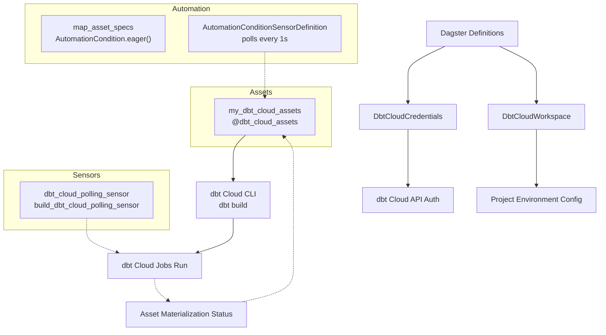
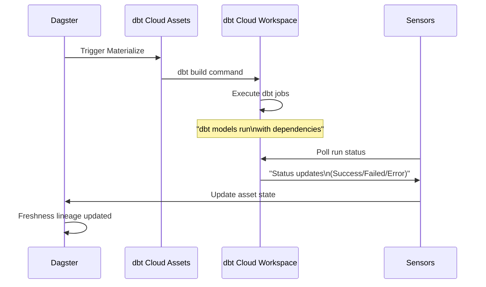

# Dagster + dbt Cloud Orchestration Flow

## Architecture Overview

## Execution Flow

## Key Components Mapping

| Component | Purpose | Line |
|-----------|---------|------|
| DbtCloudCredentials | API authentication | 10 |
| DbtCloudWorkspace | Project/env config | 17 |
| @dbt_cloud_assets | Asset discovery/execution | 25 |
| AutomationCondition.eager() | Auto-materialize | 36 |
| AutomationConditionSensorDefinition | Trigger monitoring | 40 |
| dbt_cloud_polling_sensor | Run status sync | 49 |