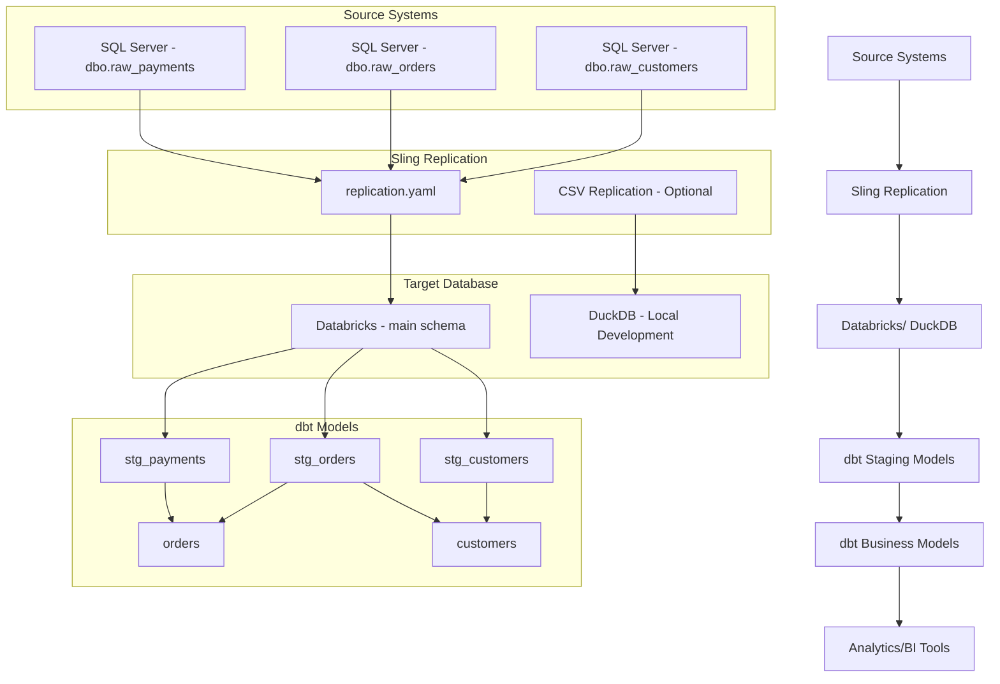

# dbx-project Architecture Analysis

## Executive Summary

The `dbx-project` is a data orchestration project built with **Dagster** that integrates **Sling** for data ingestion and **dbt** for data transformation. It's designed to work with multiple data sources including SQL Server, PostgreSQL, and Databricks, with DuckDB as a local development target.

## Project Structure

```
dbx-project/
├── pyproject.toml              # Python project configuration
├── README.md                   # Project documentation
├── uv.lock                     # Dependency lock file
├── compose/                    # Docker Compose configurations
│   ├── compose.yml            # PostgreSQL service
│   ├── compose.m.yml          # SQL Server (Microsoft registry)
│   └── compose.q.yml          # SQL Server (Quay.io registry)
├── data/                       # Raw data files
│   ├── raw_customers.csv
│   ├── raw_orders.csv
│   └── raw_payments.csv
├── dbt/                        # dbt project for transformations
│   └── jdbt/                  # Main dbt project
├── src/                        # Python source code
│   └── dbx_project/           # Main package
│       ├── definitions.py     # Dagster definitions entry point
│       └── defs/              # Dagster definitions
│           ├── ingest_files/  # Sling replication definitions
│           └── jaffle_shop_assets/  # dbt model definitions
└── tests/                      # Test files
```

## Technology Stack

### Core Dependencies
- **Dagster** (≥1.12.1): Workflow orchestration platform
- **Dagster-dbt** (≥0.28.1): Integration with dbt
- **Dagster-sling** (≥0.28.1): Integration with Sling for data replication
- **dbt-databricks** (≥1.10.14): Databricks adapter for dbt
- **dbt-duckdb** (≥1.10.0): DuckDB adapter for dbt

### Development Tools
- **uv**: Modern Python package manager (primary)
- **pip**: Alternative package manager
- **Dagster Webserver**: Local development UI

## Data Ingestion Architecture (Sling)

### Configuration Files
- **`src/dbx_project/defs/ingest_files/defs.yaml`**: Sling component definition
- **`src/dbx_project/defs/ingest_files/replication.yaml`**: Production replication config
- **`src/dbx_project/defs/ingest_files/replication_csv.yaml`**: CSV-based replication for testing

### Data Sources & Targets

#### Production Configuration (`replication.yaml`)
- **Source**: `SQL_SERVER` (SQL Server)
- **Target**: `DATABRICKS` (Databricks)
- **Streams**:
  - `dbo.raw_customers` → `main.raw_customers`
  - `dbo.raw_orders` → `main.raw_orders`
  - `dbo.raw_payments` → `main.raw_payments`

#### Development Configuration (`replication_csv.yaml`)
- **Source**: `LOCAL` (file system)
- **Target**: `DUCKDB` (DuckDB database)
- **Streams**: CSV files → DuckDB tables

### Key Features
- **Full Refresh Mode**: All streams use `mode: full-refresh`
- **Dynamic Object Naming**: Uses `{stream_table}` template for target naming
- **Modular Configuration**: Separate YAML files for different environments

## Data Transformation Architecture (dbt)

### Project Configuration
- **Project Name**: `jdbt`
- **Profile**: `jdbt`
- **Target**: `prod` (configured for Databricks in production)

### Database Targets

#### Production (Databricks)
- **Catalog**: `test`
- **Schema**: `main`
- **Warehouse**: `333120755706219a`
- **Authentication**: Token-based with `DATABRICKS_TOKEN` environment variable
- **Auth Type**: `databricks_cli`

#### Development (Commented out)
- **Type**: DuckDB
- **Path**: `/tmp/jaffle_platform.duckdb`
- **Threads**: 1

### Data Model Architecture

#### Source Configuration (`dbt/jdbt/models/sources.yml`)
- **Source**: `main` (Databricks catalog)
- **Tables**: `raw_orders`, `raw_customers`, `raw_payments`

**Where dbt reads from:**
- **Production**: Databricks catalog `main` (populated by Sling from SQL Server)
- **Development**: DuckDB database (populated by Sling from CSV files)
- **Source tables**: `dbo.raw_customers`, `dbo.raw_orders`, `dbo.raw_payments` (SQL Server) or CSV files

#### Staging Models
1. **`stg_customers.sql`**:
   - Transforms `raw_customers`
   - Maps `id` → `customer_id`
   - Extracts `first_name`, `last_name`

2. **`stg_orders.sql`**:
   - Transforms `raw_orders`
   - Maps `id` → `order_id`, `user_id` → `customer_id`
   - Extracts `order_date`, `status`

3. **`stg_payments.sql`**:
   - Transforms `raw_payments`
   - Maps `id` → `payment_id`
   - Converts `amount` from cents to dollars
   - Maps payment methods

#### Business Models

1. **`orders.sql`**:
   - Aggregates payment amounts by payment method
   - Uses Jinja templating for dynamic payment method columns
   - Calculates total order amount

2. **`customers.sql`**:
   - Customer lifetime value calculation
   - First and most recent order dates
   - Number of orders per customer
   - Joins staging models for complete customer view

## Infrastructure Configuration

### Docker Compose Services

#### PostgreSQL (`compose.yml`)
- **Image**: `postgres:16-alpine`
- **Port**: 5432
- **Container Name**: `dev-postgres`
- **Password**: `YourStrong@Passw0rd`
- **Volume**: `postgres_data` for persistent storage

#### SQL Server (`compose.m.yml`)
- **Image**: `mcr.microsoft.com/mssql/server:2022-latest`
- **Port**: 1433
- **Container Name**: `dev-sqlserver`
- **Password**: `YourStrong@Passw0rd`
- **Edition**: Developer
- **Volume**: `sqlserver_data` for persistent storage

#### SQL Server Alternative (`compose.q.yml`)
- **Image**: `quay.io/microsoft/mssql-server:2022-latest`
- Same configuration as `compose.m.yml` but uses Quay.io registry

## Data Flow Architecture



## Key Architectural Patterns

### 1. **Environment Separation**
- Separate replication configs for production vs. development
- Different dbt profiles for different targets
- Docker Compose files for different database services

### 2. **Data Vault Approach**
- Raw layer: Direct replication from sources
- Staging layer: Cleaned and standardized data
- Business layer: Aggregated and analytical models

### 3. **Infrastructure as Code**
- Docker Compose for database services
- YAML-based configuration for all components
- Environment variables for sensitive configuration

### 4. **Modular Dagster Definitions**
- Component-based architecture using YAML definitions
- Automatic loading from `defs/` directory
- Separation of ingestion and transformation logic

## Recommendations

### 1. **Security Improvements**
- Replace hardcoded passwords in Docker Compose with environment variables
- Use secrets management for database credentials
- Implement proper authentication for Databricks

### 2. **Configuration Management**
- Create environment-specific dbt profiles
- Use environment variables for all configurable parameters
- Implement configuration validation

### 3. **Development Experience**
- Add data quality tests in dbt
- Implement dbt documentation generation
- Add data lineage visualization

### 4. **Production Readiness**
- Add monitoring and alerting for data pipelines
- Implement data quality checks and SLAs
- Add backup and recovery procedures for databases

### 5. **Performance Optimization**
- Consider incremental loads for large datasets
- Implement data partitioning strategies
- Optimize dbt model performance

## Conclusion

The `dbx-project` demonstrates a well-architected data pipeline using modern data stack technologies. It effectively separates concerns between data ingestion (Sling), orchestration (Dagster), and transformation (dbt), while providing flexibility for different environments and data sources. The modular YAML-based configuration makes it maintainable and scalable for growing data needs.